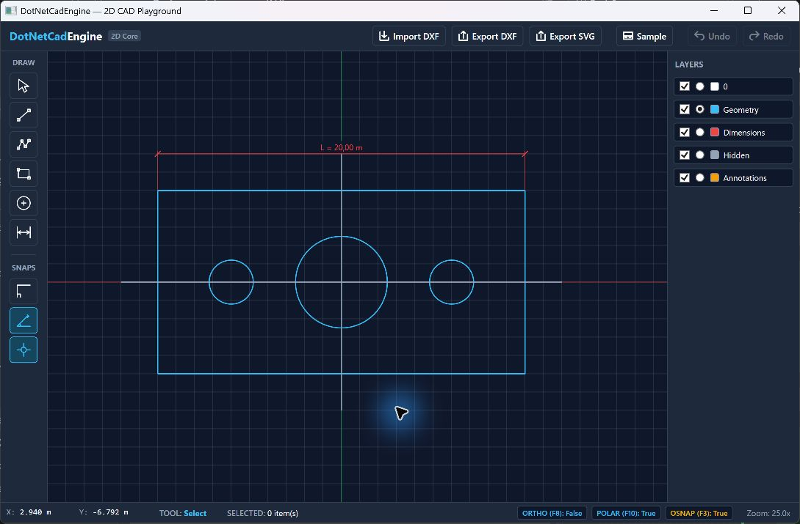
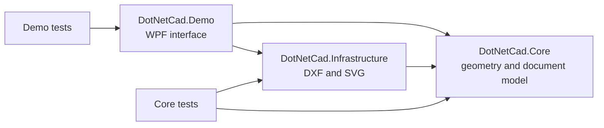

# DotNetCadEngine

A 2D CAD geometry engine in C# with a Windows desktop playground. The project separates geometric calculations from the WPF interface and provides a small, dependency-free core for drawing, measurement, snapping, selection, and file interchange.



The screenshot shows the sample drawing loaded when the desktop app starts.

## What you can do in the demo

- Draw lines, open polylines, rectangles, circles, and linear dimensions on an interactive canvas.
- Pan, zoom, select entities, edit grips, and use window or crossing selection.
- Toggle object snapping, orthogonal drawing, and polar tracking. Active modes remain highlighted in the toolbar.
- Show or hide layers and choose the active layer for new geometry.
- Undo and redo drawing operations; import a supported subset of ASCII DXF and export DXF or SVG.

The app opens with a sample mechanical bracket so the interface can be explored immediately.

## Run locally

**Requirements:** Windows 10/11 and the [.NET 10 SDK](https://dotnet.microsoft.com/download/dotnet/10.0). The WPF demo requires Windows; the Core and Infrastructure projects target `net10.0` without a UI framework.

```bash
dotnet build DotNetCadEngine.slnx
dotnet run --project src/DotNetCad.Demo/DotNetCad.Demo.csproj
```

To run the automated tests:

```bash
dotnet test DotNetCadEngine.slnx
```

### Quick tour

| Action | How |
| --- | --- |
| Draw | Choose an icon on the left, then click the required points on the canvas. |
| Finish a polyline | Right-click after placing at least two vertices. |
| Select | Click an entity, or drag left-to-right for a window selection and right-to-left for a crossing selection. |
| Edit geometry | Select one entity and drag an available grip. |
| Pan and zoom | Drag with the middle mouse button; use the mouse wheel to zoom. |
| Precision modes | Use the highlighted controls on the left, or press `F3` (object snap), `F8` (ortho), and `F10` (polar) while the canvas has focus. |
| Layers | Use a checkbox to show or hide a layer and the round selector to make a visible layer active. |
| Undo / redo | Use the toolbar or `Ctrl+Z` / `Ctrl+Y` while the canvas has focus. |
| Reset the example | Click **Sample** in the top toolbar. |

## Architecture



| Project | Responsibility |
| --- | --- |
| `src/DotNetCad.Core` | Entities, geometry, validation, measurements, snapping, selection, document state, and undo/redo. It has no external NuGet packages or WPF references. |
| `src/DotNetCad.Infrastructure` | ASCII DXF import/export and SVG export. |
| `src/DotNetCad.Demo` | WPF canvas, mouse and keyboard interaction, layers panel, and file commands. |
| `tests/DotNetCad.Core.Tests` | Geometry, parsing, snapping, selection, history, and interchange checks. |
| `tests/DotNetCad.Demo.Tests` | Viewport transformation checks. |

The core includes line, polyline, rectangle, circle, arc, and dimension entities. It also contains calculations for intersections, offsets, fillets, trimming, extension, transforms, polygon measurements, and coordinate parsing. Keeping these operations in the core makes them usable without launching the desktop app.

## File formats and current scope

The DXF importer supports a focused subset of ASCII entities: `LINE`, `CIRCLE`, `ARC`, and `LWPOLYLINE`, plus layer information. The exporter writes those shapes and represents rectangles as polylines and dimensions as basic line/text entities. Colors map to a small AutoCAD Color Index palette, and coordinates are rounded during export. This is a practical interchange example, not a full DXF implementation or a guarantee of lossless round trips with arbitrary CAD files.

SVG export writes vector shapes grouped by visible layer and converts CAD's upward Y axis to SVG coordinates.

Some operations available in the core, including offsets, trimming, extension, fillets, transforms, and text-based coordinate entry, do not yet have dedicated controls in the desktop playground. The demo is intended to showcase the engine and its interaction model, rather than to replace a production CAD application.

## License

Licensed under the [MIT License](LICENSE).
