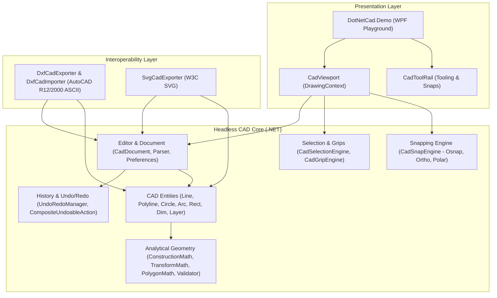

# DotNetCadEngine

> A lightweight 2D CAD engine and WPF technical drawing playground built with C# and .NET.

---

## Overview

**DotNetCadEngine** is an open-source, decoupled 2D Computer-Aided Design (CAD) computational geometry engine and interactive desktop technical playground. Built from the ground up on modern .NET, it provides a clean, dependency-free core for constructing, measuring, validating, transforming, snapping, and exporting 2D vector drawing primitives.

The engine was architected with a strict separation between analytical geometry and presentation logic: the computational core has **zero external NuGet dependencies** and zero references to UI frameworks (`System.Windows`, WPF, WinForms), making it headless, fast, and 100% testable in automated pipelines.

---

## Features

- **Pure Computational Geometry**: Native implementations of intersection solvers, parallel offsetting, polygonal area via the Shoelace formula, centroid calculation, raycasting containment, fillet rounding, segment extension, and boundary trimming.
- **Strict Geometric Validation**: Robust rejection of `NaN`/`Infinity` coordinates, degenerate segments, zero/negative radii, and self-intersecting (hourglass/bow-tie) polygons.
- **Parametric CAD Entities**: Line, Polyline, Rectangle, Circle, Arc, and Linear Dimension entities organized by layers.
- **Precision Snapping Engine (OSNAP)**: Object snapping to Endpoints, Midpoints, Quadrants, and Centers with customizable screen-pixel hit tolerances.
- **Angular Tracking Modes**: Orthogonal drawing mode (**F8 Ortho**) and angular guide attraction (**F10 Polar Tracking** with configurable increment angles).
- **Direct Coordinate & Distance Parser**: Absolute Cartesian (`X,Y` / `X;Y`), relative displacement (`@dx,dy`), polar vector (`@distance<angle`), and cursor-directed distance entry.
- **CAD Selection Modes**: Industrial **Window Selection** (blue box, left-to-right, strict containment) and **Crossing Selection** (green dashed box, right-to-left, intersection/overlap), plus point hit-testing and interactive vertex/midpoint grip manipulation.
- **Transactional Undo / Redo**: Dual-stack command history with atomic composite action rollback (if any intermediate step fails, all preceding actions are reversed in inverse order).
- **AutoCAD DXF Interoperability**: Native, zero-dependency ASCII DXF R12/2000 reader and writer supporting `LINE`, `LWPOLYLINE`, `CIRCLE`, `ARC`, `LAYER`, and AutoCAD Color Index (ACI) palette mapping.
- **W3C SVG Vector Export**: Scalable vector graphics exporter with coordinate system re-mapping, layer grouping, and styling.
- **Interactive WPF Technical Playground**: Hardware-accelerated WPF canvas using `DrawingVisual` and `DrawingContext` with infinite dynamic grid, real-time crosshair cursor, pickbox, HUD status bar, and technical dark theme.

---

## Architecture

The system enforces a clean, modular onion architecture where the presentation layer depends only on abstraction interfaces and the core math remains pure and headless:



---

## Project Structure

```text
DotNetCadEngine/
├── DotNetCadEngine.slnx           # Solution file (.NET 10 / slnx format)
├── README.md                      # Documentation
├── .gitignore
│
├── src/
│   ├── DotNetCad.Core/            # Headless 2D CAD engine (Zero dependencies)
│   │   ├── Geometry/              # Point2D, Vector2D, BoundingBox2D, Math solvers
│   │   ├── Entities/              # Line, Polyline, Rectangle, Circle, Arc, Dimension
│   │   ├── Editor/                # CadDocument, CadCoordinateParser, Preferences
│   │   ├── Snapping/              # CadSnapEngine, Osnap, Ortho F8, Polar F10
│   │   ├── Selection/             # CadSelectionEngine (Window/Crossing), CadGripEngine
│   │   ├── History/               # UndoRedoManager, CompositeUndoableAction
│   │   └── Measurements/          # Distance, azimuth, and polygon measurements
│   │
│   ├── DotNetCad.Infrastructure/  # File formats & vector interchange
│   │   ├── Dxf/                   # Native DXF ASCII R12/2000 Importer & Exporter
│   │   └── Svg/                   # Native W3C SVG Exporter
│   │
│   └── DotNetCad.Demo/            # Technical WPF playground application
│       ├── Controls/              # CadViewport (DrawingContext renderer), CadToolRail
│       ├── ViewModels/            # MainViewModel, LayerItemViewModel
│       ├── Mvvm/                  # ObservableObject, RelayCommand
│       └── Themes/                # DarkCadTheme.xaml
│
└── tests/
    ├── DotNetCad.Core.Tests/      # Comprehensive unit tests for math and core
    └── DotNetCad.Demo.Tests/      # Presentation & viewport transform tests
```

---

## CAD Entities

| Entity | Description | Geometric Properties |
| :--- | :--- | :--- |
| `CadLine` | 2D straight line segment | `StartPoint`, `EndPoint`, `Length`, `Midpoint` |
| `CadPolyline` | Open or closed polygonal chain | `Vertices`, `IsClosed`, `Length`, `Area` |
| `CadRectangle` | Rotated rectangular boundary | `Origin`, `Width`, `Height`, `RotationDegrees` |
| `CadCircle` | Planar circular curve | `Center`, `Radius`, `Diameter`, `Circumference`, `Area` |
| `CadArc` | Circular arc with sweep bounds | `Center`, `Radius`, `StartAngleDegrees`, `EndAngleDegrees`, `SweepAngle` |
| `CadDimension` | Linear aligned technical annotation | `StartPoint`, `EndPoint`, `OffsetPoint`, `FormattedText` |

All entities implement `ICadEntity`, supporting translation, rotation, mirroring, clone duplication, and axis-aligned bounding box (`BoundingBox2D`) calculation.

---

## Editing & Transformation Tools

- **Move**: Translates selected entities by delta \(\Delta X, \Delta Y\).
- **Rotate**: Rotates entities around an arbitrary origin point by \(\theta^\circ\).
- **Mirror**: Reflects geometry symmetrically across an arbitrary 2D line axis \(P_1 \to P_2\).
- **Offset**: Generates parallel curves and outward/inward polygon expansions at exact metric distances.
- **Trim**: Cuts segments against cutting boundaries based on the user's cursor hit position.
- **Extend**: Extends line segments forward until contacting boundary entities.
- **Fillet**: Rounds sharp corners between non-parallel line segments with a specified radius.

---

## Snapping (OSNAP) & Precision Tracking

The `CadSnapEngine` evaluates screen pixel hit radii converted to world units based on current zoom:
1. **Endpoint**: Snaps to line and arc endpoints, and polyline vertices.
2. **Midpoint**: Snaps to the exact midpoint of line and polyline segments.
3. **Center**: Snaps to circle and arc centers.
4. **Grid Snap**: Snaps to configurable metric intervals (default 0.5m).
5. **Ortho Mode (F8)**: Locks movement strictly to horizontal or vertical axes.
6. **Polar Tracking (F10)**: Projects dynamic alignment rays at standard angular intervals (\(15^\circ, 30^\circ, 45^\circ, 90^\circ\)).

---

## Selection System

`CadSelectionEngine` replicates professional CAD selection standards:
- **Window Selection** (dragged Left to Right): Rendered as a blue semi-transparent rectangle. Only entities whose bounding box is **100% inside** the selection window are selected.
- **Crossing Selection** (dragged Right to Left): Rendered as a green semi-transparent rectangle with a dashed border. Selects any entity that **intersects or is contained within** the rectangle.
- **Grip Editing**: Clicking an entity displays grip handles. Dragging a grip dynamically stretches endpoints, vertices, or radii with live visual preview.

---

## Undo / Redo

The engine implements atomic, command-based state management via `UndoRedoManager`:
- History stack capped at 100 operations.
- `CompositeUndoableAction` groups multiple mutations (e.g. deleting or moving 50 entities at once).
- **Atomic Rollback Guarantee**: If an error occurs during execution of any sub-action, all preceding sub-actions are reversed in inverse order, preventing document corruption.

---

## DXF & SVG Interoperability

- **AutoCAD DXF**: Read and write AutoCAD R12/2000 ASCII format. Entities and layers are serialized with standard group codes (`0`, `2`, `8`, `10`, `20`, `40`, `50`, `62`).
- **SVG Export**: High-resolution vector export for web embedding, documentation, and reporting.

---

## Building and Running

### Prerequisites
- [.NET 10 SDK](https://dotnet.microsoft.com/download) (or .NET 8 / 9)
- Windows 10/11 (for the WPF Demo project; Core and Infrastructure are cross-platform)

### Build Solution
```bash
dotnet build DotNetCadEngine.slnx
```

### Run Unit Tests
```bash
dotnet test
```

### Run WPF Demo Playground
```bash
dotnet run --project src/DotNetCad.Demo/DotNetCad.Demo.csproj
```

---

## Testing Strategy

The solution features a comprehensive test suite in `tests/DotNetCad.Core.Tests` and `tests/DotNetCad.Demo.Tests`:
- `GeometryMathTests`: Area formulas, vector math, bounding boxes.
- `CadConstructionMathTests`: Offsets, fillet, trimming, extending, intersections.
- `CadTransformMathTests`: Rotations and reflections.
- `GeometryValidatorTests`: Self-intersection and boundary limits.
- `CadCoordinateParserTests`: Numerical, relative, polar, and direct distance entry.
- `CadMeasurementMathTests`: Azimuth and angle calculations.
- `CadSnapEngineTests`: Grid snap, Osnap points, Ortho, Polar tracking.
- `CadSelectionEngineTests`: Window vs Crossing selection logic, grip manipulation.
- `UndoRedoIntegrityTests`: Stack limit, rollback safety on failed commands.
- `DxfRoundTripTests`: Lossless export and reimport of drawing entities.
- `SvgExporterTests`: Valid XML tag generation and coordinate inversion.
- `ViewportTransformTests`: World-to-screen and screen-to-world round-tripping.

---

## License

This project is licensed under the MIT License - see the `LICENSE` file for details.
