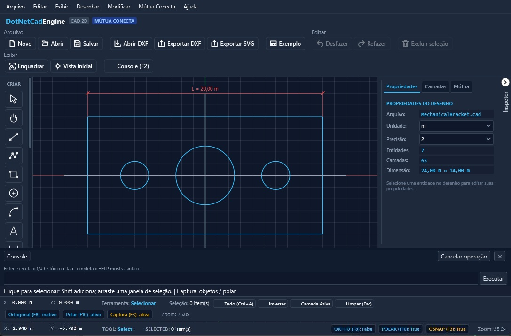
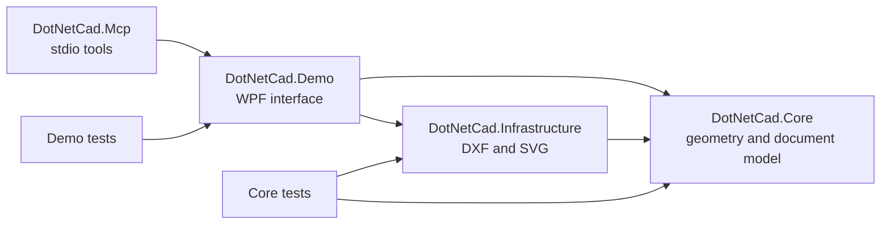

# DotNetCadEngine

[](https://github.com/led-21/DotNetCadEngine/actions/workflows/ci.yml)

A 2D CAD geometry engine in C# with a Windows desktop playground. The project separates geometric calculations from the WPF interface and provides a small, dependency-free core for drawing, measurement, snapping, selection, and file interchange.



The screenshot shows the sample drawing loaded when the desktop app starts.

## What you can do in the demo

- Draw lines, open polylines, rectangles, circles, and linear dimensions on an interactive canvas.
- Modify existing geometry with dedicated toolbar tools and real-time previews: **Trim (Aparar)**, **Extend (Estender)**, **Move**, **Copy**, **Rotate**, **Mirror**, **Offset**, and **Break**.
- Real-time interactive feedback: cutting boundaries highlighted in amber dashed lines, trimmed segments in red dashed lines with intersection points, and proposed extensions in green dashed lines with target markers.
- Pan, zoom, select entities, edit grips, and use window or crossing selection.
- Toggle object snapping, orthogonal drawing, and polar tracking. Active modes remain highlighted in the toolbar.
- Show, hide, and lock layers; choose the active layer for new geometry. Locked layers prevent accidental edits.
- Undo and redo drawing and modification operations; save and reopen native `.cad` drawings, import a supported subset of ASCII DXF, and export DXF or SVG.
- Create geometry and execute batch workflows from the integrated CAD/AI console or through an MCP client connected to the open drawing.

The app opens with a sample mechanical bracket so the interface can be explored immediately.

## Run locally

**Requirements:** Windows 10/11 and the [.NET 10 SDK](https://dotnet.microsoft.com/download/dotnet/10.0). The WPF demo requires Windows; the Core and Infrastructure projects target `net10.0` without a UI framework.

```bash
dotnet build DotNetCadEngine.slnx
dotnet run --project src/DotNetCad.Demo/DotNetCad.Demo.csproj
```

To run the automated tests:

```bash
dotnet test DotNetCadEngine.slnx
```

### Quick tour

| Action | How |
| --- | --- |
| Draw | Choose an icon on the left, then click the required points on the canvas. |
| Finish a polyline | Right-click after placing at least two vertices. |
| Select | Click an entity, or drag left-to-right for a window selection and right-to-left for a crossing selection. |
| Edit geometry (Grips) | Select one entity and drag an available grip. |
| Trim (Aparar) | Click the Trim icon on the modification rail (or type `TR`), select cutting boundary entities (press Enter to confirm), then click the segments to cut. Esc cancels the step; Enter finishes. |
| Extend (Estender) | Click the Extend icon on the modification rail (or type `EX`), select boundary entities (press Enter), then click near the endpoint you want to extend. |
| Modify (Move/Copy/Rotate/Mirror/Offset/Break) | Select entities and click the corresponding tool rail icon, or run the command via console. |
| Pan and zoom | Drag with the middle mouse button; use the mouse wheel to zoom. |
| Precision modes | Use the highlighted controls on the left, or press `F3` (object snap), `F8` (ortho), and `F10` (polar) while the canvas has focus. |
| Layers | Use a checkbox to show/hide a layer, the lock icon to protect it from mutations, and the round selector to make a visible layer active. |
| New / Open / Save | Use the top toolbar to start a drawing, open `.cad` or `.dxf`, and save a native `.cad` file. The app asks before discarding unsaved changes. |
| Undo / redo | Use the toolbar or `Ctrl+Z` / `Ctrl+Y` while the canvas has focus. |
| Reset the example | Click **Sample** in the top toolbar. |
| Use the console | Enter a command in the bottom panel and press Enter. AI/MCP actions appear in the same history. |

## CAD console and MCP

The bottom console accepts commands directly in the current drawing. Coordinates use `x;y` and spaces separate points. For example:

```text
LAYER AI
LINE 0;0 80;0
CIRCLE 40;20 12
RECT 10;10 30;25
POLYLINE 0;0 20;15 40;0
TEXT 2;2 0.5 Quarto 1
DIM 0;0 5;0 2.5;-0.5
LIST
UNDO
```

Use `HELP` in the console for the full command list, including arcs, entity deletion, clearing the drawing, and redo. `TEXT x;y height words...` adds a single-line label on the active layer; `DIM startX;startY endX;endY offsetX;offsetY` adds an aligned measurement. Heights and coordinates are in drawing units, and dimensions display meters. Console and MCP edits use the same document and undo history as the graphical tools.

To edit an existing line, run `LIST` to obtain its ID (or call `describe_drawing` through MCP for IDs and line endpoints). The following commands operate on line entities and each edit can be undone in one step:

```text
BREAK lineId 4;0 6;0
TRIM lineId boundaryLineId 9;0
EXTEND lineId boundaryLineId END
OFFSET lineId 0.2 LEFT
```

`BREAK` removes the portion between two points on the line; `TRIM` removes the side nearest the pick point; `EXTEND` moves the chosen `START` or `END` to a boundary segment. These commands replace the edited line, so use the new ID returned by the command for subsequent edits. `OFFSET` adds a parallel line without changing the original. It also accepts a circle ID and a signed distance to create a concentric circle. All coordinates and distances use drawing units.

Use the ID of any entity with these transformation commands:

```text
MOVE entityId 2;1
COPY entityId 4;0
ROTATE entityId 0;0 90
MIRROR entityId 0;0 0;10
```

`MOVE` and `COPY` use an `x;y` displacement. `ROTATE` takes a center and an angle in degrees (positive is counterclockwise); `MIRROR` takes two points defining the reflection axis. Move, rotate, and mirror retain the original ID. Copy creates an independent entity with a new ID while preserving its layer and style. Each command is one undoable operation.

Layers and entities can be inspected and organized from the console or MCP:

```text
LAYER SHOW PAREDES
LAYER HIDE PORTAS
LAYER COLOR PAREDES #38BDF8
PROPERTIES entityId
PROPERTIES LAYER PAREDES
```

Hiding the active layer selects another visible layer; the last visible active layer cannot be hidden. Changing a layer color also recolors existing entities that still use its previous color, while preserving custom entity colors. Visibility and color changes can be undone. `PROPERTIES` reports exact geometry, style and bounds without editing the drawing. The MCP tools are `show_layer`, `hide_layer`, `set_layer_color`, `get_entity_properties` and `get_layer_properties`.

To frame the visible drawing and keep it between sessions, use:

```text
ZOOM EXTENTS
SAVE "C:\Drawings\House.cad"
OPEN "C:\Drawings\House.cad"
NEW
```

`SAVE` writes the native `.cad` format, preserving entity IDs, geometry, layers and preferences. Once a native file is open or saved, `SAVE` can omit the path. `OPEN` also reads `.dxf` files; use `SAVE path.cad` afterward to keep an editable native copy. `NEW` starts an empty drawing. When the current drawing has unsaved changes, `OPEN` and `NEW` return an error; save first or explicitly use `OPEN DISCARD path` / `NEW DISCARD`. Paths containing spaces may be quoted. These commands are available through MCP as `zoom_extents`, `save_drawing`, `open_drawing` and `new_drawing`; the latter two require `discardUnsaved: true` to replace unsaved work.

`DotNetCad.Mcp` is a local stdio MCP server for AI clients. Keep the WPF app running while using it: the server connects to the open app through a Windows named pipe and edits the drawing visible on screen. It exposes tools to inspect entities and layers, add lines, circles, rectangles, arcs, polylines, text labels and aligned dimensions, break/trim/extend lines, offset lines and circles, move/copy/rotate/mirror entities, control layer visibility and color, frame, save, open or start a drawing, execute a console command, and export SVG or ASCII DXF. Export tools return file content to the client; they do not choose a destination or save a file automatically.

After building the solution, configure a stdio-capable MCP client to launch the server. Replace the path with the absolute path on your machine:

```json
{
  "mcpServers": {
    "dotnetcad": {
      "command": "dotnet",
      "args": ["C:\\absolute\\path\\to\\DotNetCadEngine\\src\\DotNetCad.Mcp\\bin\\Debug\\net10.0\\DotNetCad.Mcp.dll"]
    }
  }
}
```

Client configuration formats vary. The sample above is for clients that use an `mcpServers` object. Start one instance of the desktop app before calling the tools.

## Architecture


```mermaid
flowchart LR
    Demo[DotNetCad.Demo<br/>WPF interface] --> Core[DotNetCad.Core<br/>geometry and document model]
    Demo --> Infra[DotNetCad.Infrastructure<br/>DXF and SVG]
    Mcp[DotNetCad.Mcp<br/>stdio tools] --> Demo
    Infra --> Core
    CoreTests[Core tests] --> Core
    CoreTests --> Infra
    DemoTests[Demo tests] --> Demo
```

| Project | Responsibility | Documentation |
| --- | --- | --- |
| `src/DotNetCad.Core` | Pure 2D geometric engine, entity models, tolerance policies, polymorphic trimming/extending, session state machines, batch processing, and undo/redo. Zero external NuGet or UI dependencies. | [Core README](src/DotNetCad.Core/README.md) |
| `src/DotNetCad.Infrastructure` | ASCII DXF import/export, SVG vector export, and native `.cad` JSON serialization. | [Infrastructure README](src/DotNetCad.Infrastructure/README.md) |
| `src/DotNetCad.Demo` | WPF desktop application with interactive canvas (`CadViewport`), precision snapping, tool rail, HUD messages, and real-time visual previews. | [Demo README](src/DotNetCad.Demo/README.md) |
| `src/DotNetCad.Mcp` | Stdio MCP (Model Context Protocol) server communicating with the running desktop app via Windows named pipes for AI agents. | [MCP README](src/DotNetCad.Mcp/README.md) |
| `tests/DotNetCad.Core.Tests` | 177 unit tests covering geometry, scale/precision policies, trimming/extending, batch staging, and undo/redo integrity. | [Tests README](tests/README.md) |
| `tests/DotNetCad.Demo.Tests` | 62 integration tests covering viewport interactions, STA WPF input completion, and layout matrices. | [Tests README](tests/README.md) |

The core includes line, polyline, rectangle, circle, arc, and dimension entities. It also contains calculations for intersections, offsets, fillets, trimming, extension, transforms, polygon measurements, and coordinate parsing. Keeping these operations in the core makes them usable without launching the desktop app.

## Technical documentation

Detailed technical documentation and engineering specifications:

- [CAD Architecture & Technical Decisions](docs/CAD-ARCHITECTURE-DECISIONS.md): Unified layer rules, console & viewport interaction lifecycle, numeric tolerances, and AI transactional batch processing.
- [DXF Compatibility Matrix](docs/DXF-COMPATIBILITY-MATRIX.md): Formal Autodesk DXF AC1009 (R12) and AC1015 (2000) import/export compliance.
- [Packaging & Installer Strategy](docs/INSTALLER.md): Inno Setup 6 architecture, self-contained x64 deployment, and vector splash screen.

## File formats and current scope

The DXF importer supports a focused subset of ASCII entities: `LINE`, `CIRCLE`, `ARC`, `LWPOLYLINE`, and single-line `TEXT`, plus layer information. The exporter writes those shapes and represents rectangles as polylines and dimensions as basic line/text entities. Colors map to a small AutoCAD Color Index palette, and coordinates are rounded during export. This is a practical interchange example, not a full DXF implementation or a guarantee of lossless round trips with arbitrary CAD files.

SVG export writes vector shapes grouped by visible layer and converts CAD's upward Y axis to SVG coordinates.

Interactive graphical tools with real-time preview and dedicated toolbar controls are available in the desktop playground for **Trim (Aparar)**, **Extend (Estender)**, **Move**, **Copy**, **Rotate**, **Mirror**, **Offset**, and **Break**. All geometric operations in the Core are integrated across graphical tools, the CAD console, and the MCP server.

## CI

O projeto é validado sob demanda via GitHub Actions (`workflow_dispatch`):
- O build completo e os testes da solução (incluindo a interface WPF) são validados no Windows (`windows-latest`).
- O `DotNetCad.Core` e o `DotNetCad.Infrastructure` são validados de forma desacoplada no Linux (`ubuntu-latest`).

## License

DotNetCadEngine é distribuído sob a licença **[PolyForm Noncommercial 1.0.0](LICENSE)**.

- **Uso Não-Comercial & Portfólio:** O código é aberto para avaliação técnica, estudo de arquitetura, pesquisa e fins educacionais.
- **Uso Comercial:** É vedada a exploração comercial, sublicenciamento ou distribuição em produtos comerciais fechados sem autorização formal do autor ([Adriano Godoy](https://github.com/led-21)).
